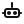

<!-- Social preview: put a 1280x640 image at assets/brand/makerfriends-social-preview.png -->

  

  
  
  
  
  

<h1 align="center">MakerFriends</h1>

<b>Spark a million maker moments.</b> Free, open STEM and STEAM projects, lessons, and tools where creativity meets community.

---

## 🔧 What we do
-  **Hands-on projects:** electronics, robotics, woodworking, 3D printing.
-  **Community directory:** find collaborators and mentors.
-  **MakerSpace finder:** equipment, pricing, specialties.
-  **Learning hub:** tutorials and printables.

## 💡 Why it exists
We make building things fun, accessible, and social. Low-cost parts, printable assets, and free curricula so anyone can start today.

## 🧭 Quick links
-  Website: https://makerfriends.com  
-  Projects: `/projects`  
-  Makers: `/makers`  
-  MakerSpaces: `/makerspaces`  
-  Blog: `/blog`  
-  Contact: `/contact`  
-  Donate: `/donate`

## 🗺️ Featured areas

  <table>
    <tr>
      <td align="center" width="25%"> <b>Electronics</b> LEDs, sensors, power</td>
      <td align="center" width="25%"> <b>Robotics</b> motion, control, AI</td>
      <td align="center" width="25%"> <b>Fabrication</b> wood, laser, CNC</td>
      <td align="center" width="25%"> <b>3D + Paper</b> models, props, pop-ups</td>
    </tr>
  </table>

## 📦 Repos in this org
makerfriends/
├─ projects/ # Build guides, code, and printables
├─ curriculum/ # Lesson plans, pacing, rubrics
├─ site/ # Astro site for makerfriends.com
├─ assets/ # Logos, mascot art, diagrams, icons
└─ docs/ # Org docs and how-tos

## 🤝 Contributing
1) Fork the repo you want to help with  
2) Create a branch: `git checkout -b feature/your-change`  
3) Keep commits clear and use straight quotes only  
4) Open a PR with a short description and, if UI, screenshots

See `CODE_OF_CONDUCT.md` and `CONTRIBUTING.md` (coming soon).

## ❤️ Support the mission
Membership is free. Donations keep projects, classroom kits, and community challenges moving.  

## 📄 License
Unless noted otherwise, content and code are released under the MIT License.

   
  <i>Build together. Learn together.</i>

